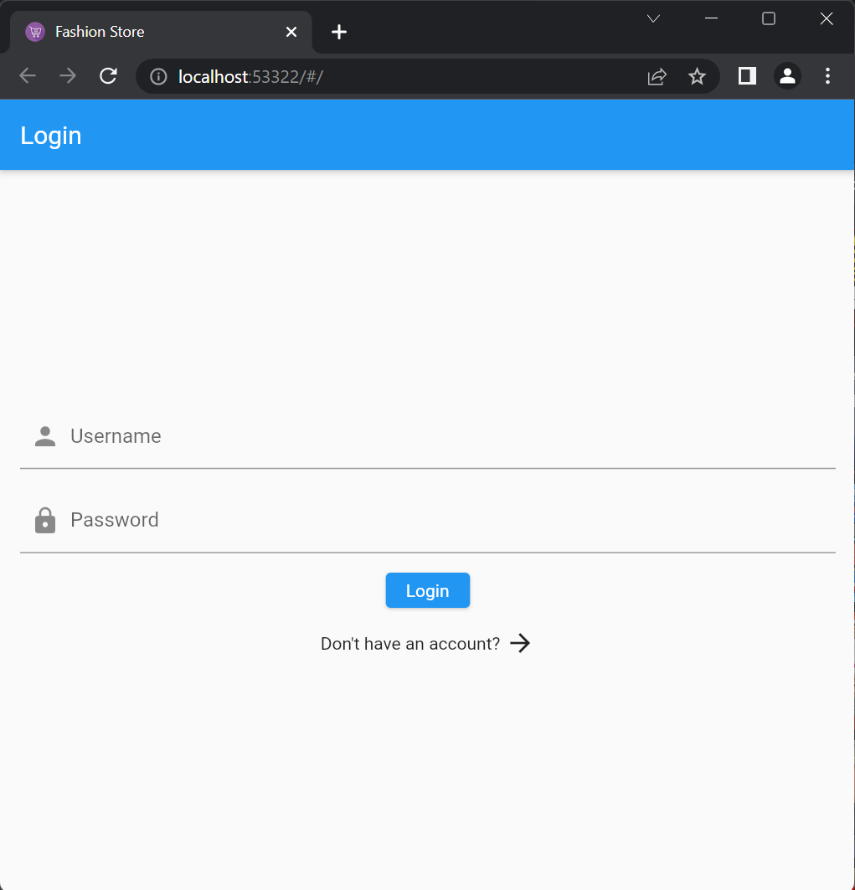
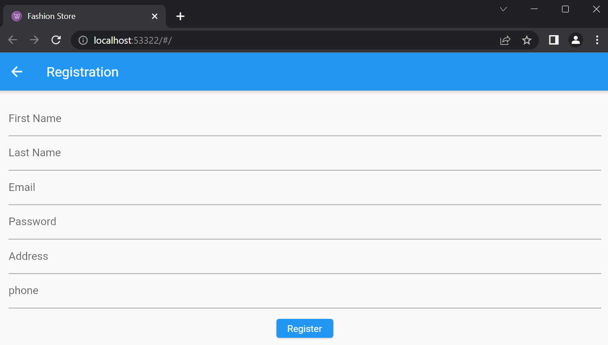
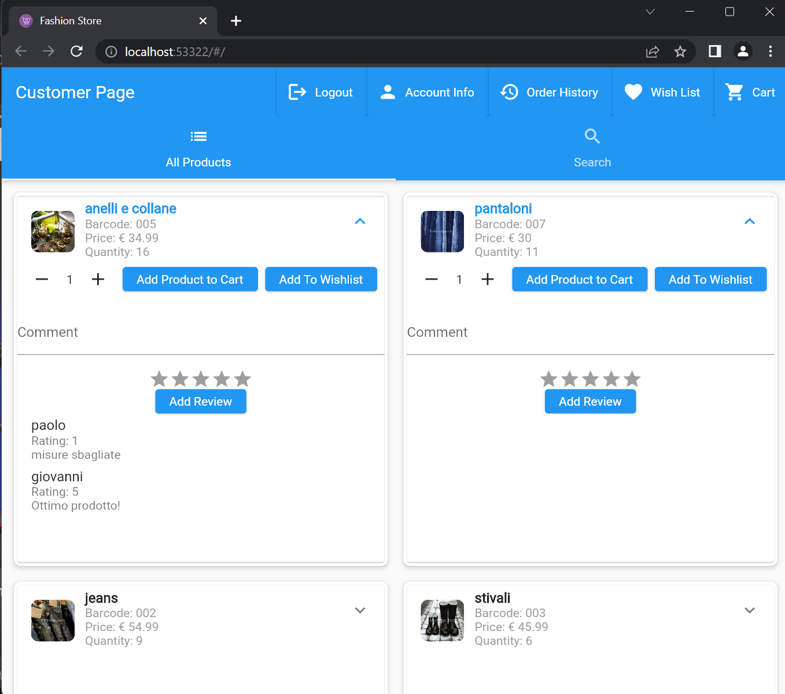
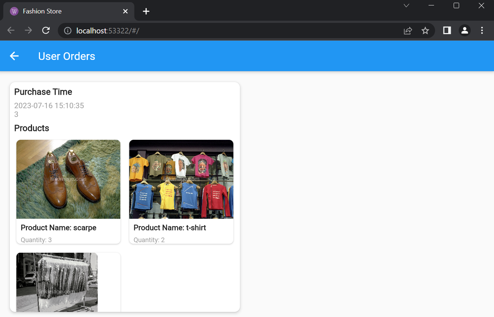
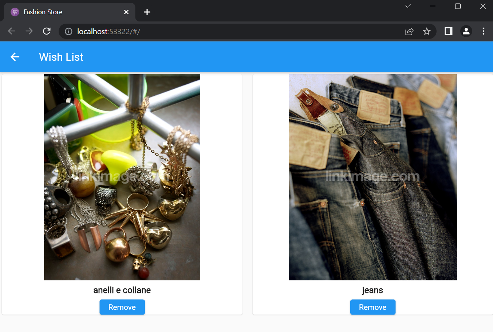
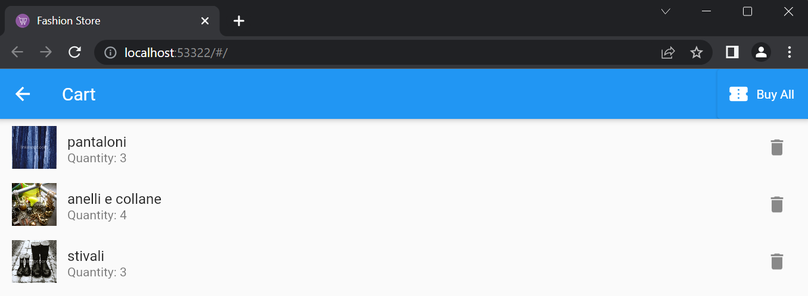
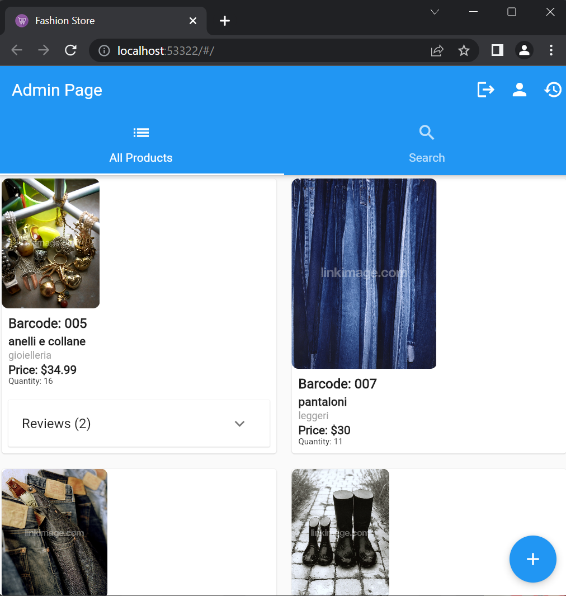
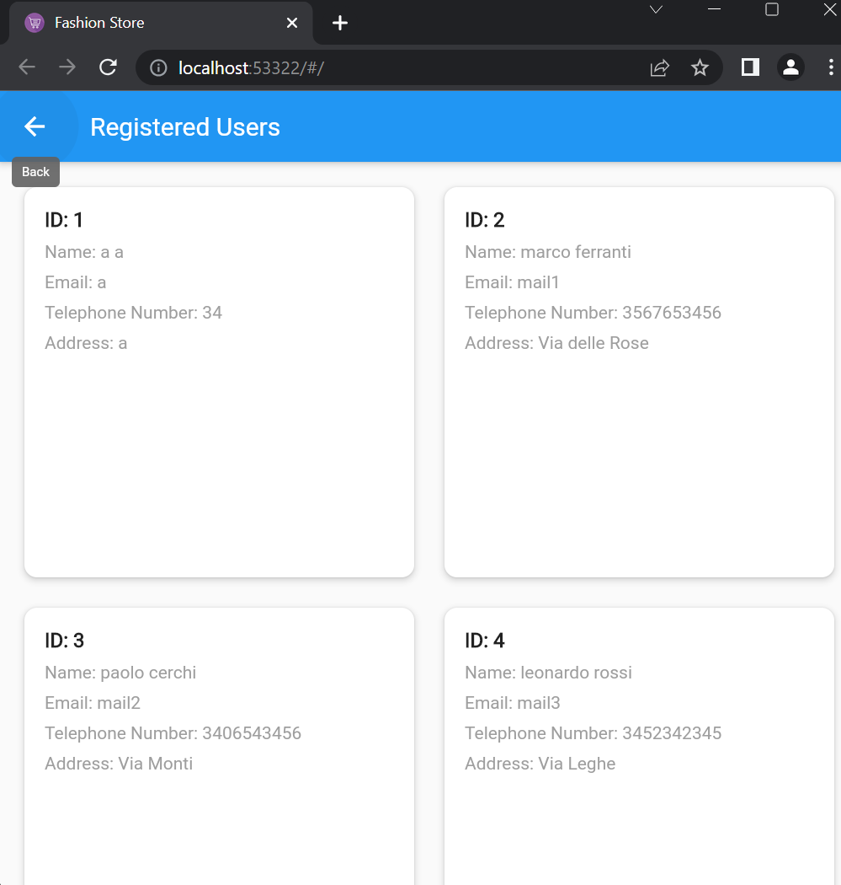
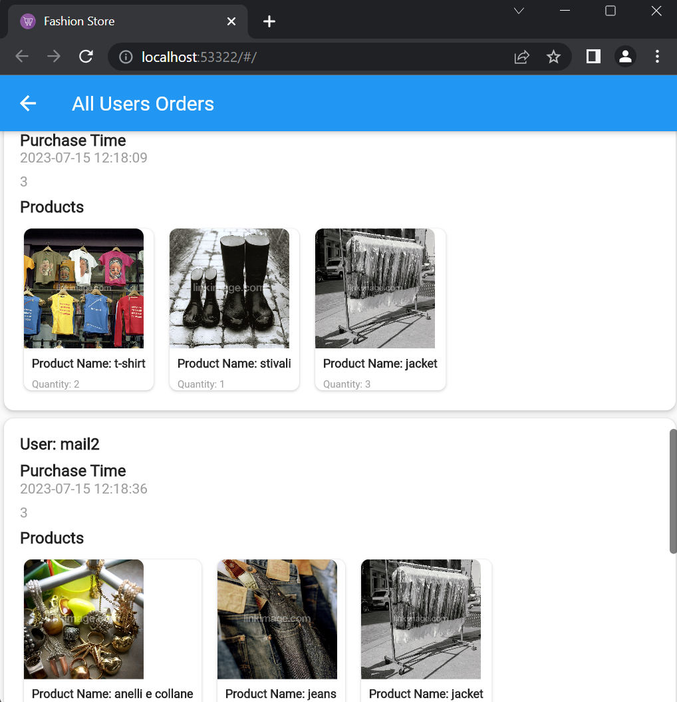
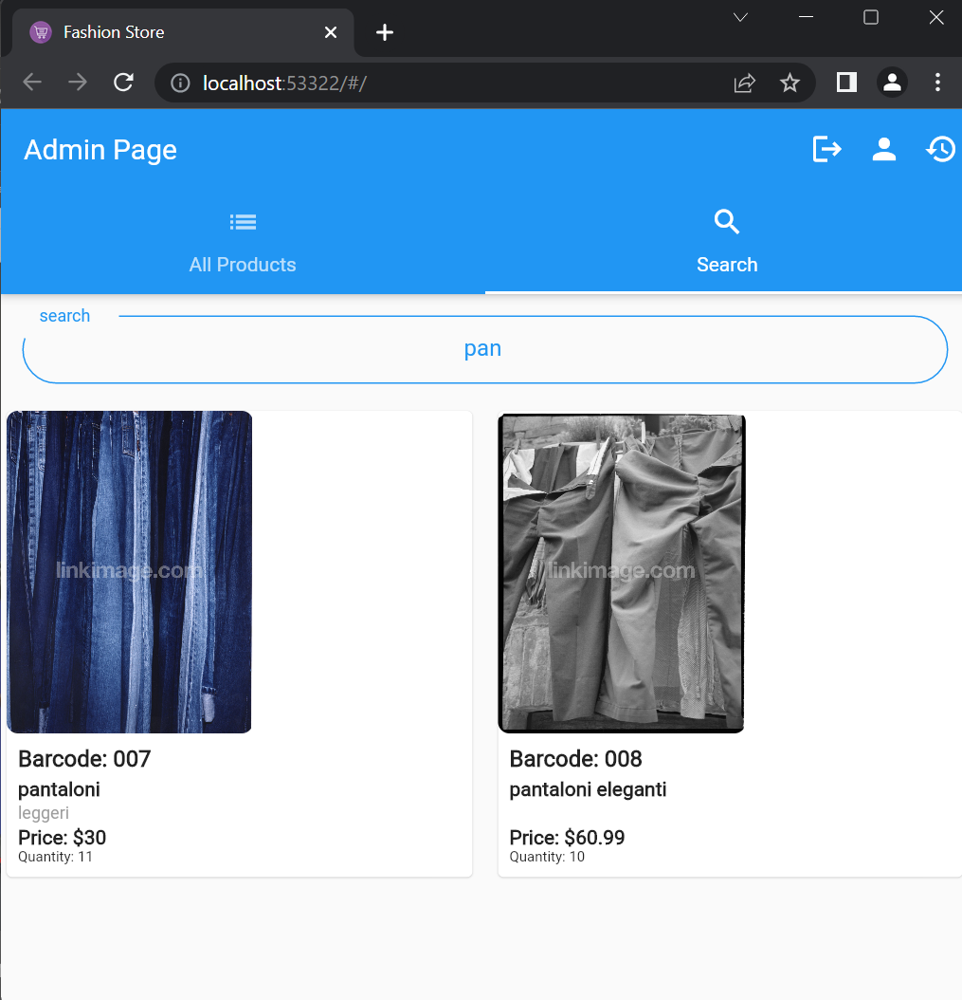

# Frontend Fashion Store

## Descrizione 

Applicazione per e-commerce che permette agli utenti di effettuare acquisti di prodotti. L'app supporta anche funzionalità di autenticazione e autorizzazione utilizzando Keycloak come servizio di gestione delle identità.

### Funzionalità principali

1. **Gestione utenti**: L'applicazione consente agli utenti di registrarsi, effettuare il login e visualizzare il proprio profilo. I dettagli degli utenti, come nome, cognome, indirizzo e numero di telefono, vengono memorizzati nel database.

2. **Visualizzazione dei prodotti**: Gli utenti possono visualizzare una lista di prodotti disponibili per l'acquisto. Ogni prodotto ha un nome, una descrizione, un'immagine, un prezzo e una quantità disponibile.

3. **Carrello degli acquisti**: Gli utenti possono aggiungere prodotti al proprio carrello degli acquisti. Il carrello tiene traccia dei prodotti selezionati e delle relative quantità.

4. **Effettuazione degli ordini**: Gli utenti possono confermare e completare gli ordini, effettuando il pagamento dei prodotti presenti nel carrello.

5. **Gestione degli ordini**: L'applicazione consente agli utenti con ruolo di amministratore di visualizzare tutti gli ordini effettuati dagli utenti. Gli ordini vengono visualizzati in una griglia, mostrando i dettagli dell'acquirente, il momento dell'acquisto e i prodotti acquistati.

6. **Integrazione con Keycloak**: L'applicazione si integra con Keycloak per la gestione dell'autenticazione e dell'autorizzazione. I dettagli degli utenti vengono sincronizzati con il real di Keycloak durante la registrazione.

### Tecnologie utilizzate

Le principali tecnologie utilizzate nell'applicazione sono:

- Flutter: un framework per lo sviluppo di app multi-piattaforma con un singolo codice sorgente.
- Dart: il linguaggio di programmazione utilizzato per lo sviluppo dell'app Flutter.
- PostgreSQL: un sistema di gestione di database relazionale utilizzato per la memorizzazione dei dati dell'applicazione.
- Keycloak: una piattaforma di gestione delle identità e degli accessi, utilizzata per l'autenticazione e l'autorizzazione degli utenti dell'applicazione.

### Struttura del codice

Il codice sorgente dell'applicazione è organizzato in diversi package:

- `model`: contiene le classi che definiscono i modelli dei dati utilizzati nell'applicazione, come User, Product, Purchase, etc.
- `controllers`: contiene i controller che gestiscono le richieste REST provenienti dall'applicazione.
- `services`: contiene i servizi che gestiscono la logica di business dell'applicazione, come la gestione degli utenti, dei prodotti e degli ordini.
- `repositories`: contiene le classi che interagiscono con il database per effettuare le operazioni di lettura e scrittura dei dati.
- `support`: contiene classi di supporto, come le eccezioni personalizzate e le utility per la conversione dei dati.
- `views`: contiene le pagine e i widget dell'interfaccia utente dell'applicazione.

## Login

  

## Registration

  

## User View

### User Page

  

### User Orders

  

### User Wish List

  

### User Cart View

  

## Admin View

### Admin Page

  

### Admin All Users

  

### Admin All Orders

  

### Admin Search

  

